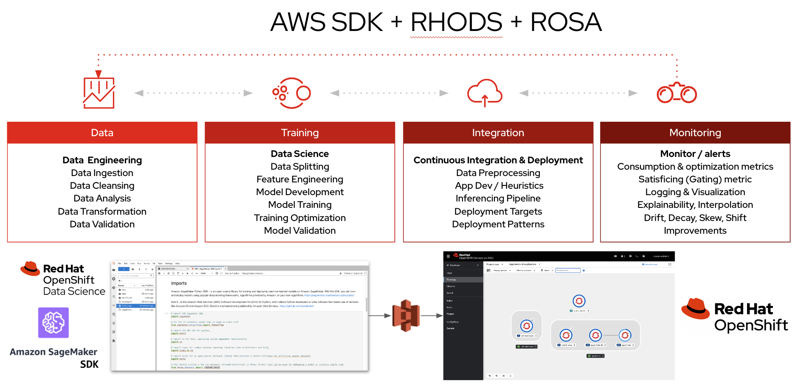
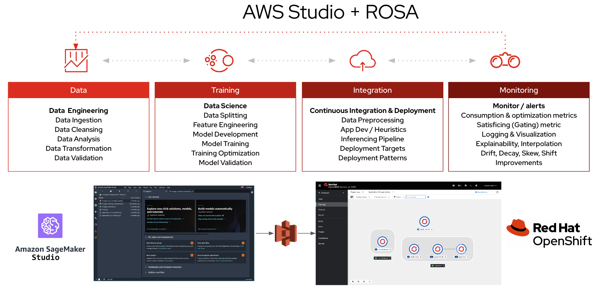

# ML with SageMaker SDK on ROSA with RHODS

The goal of this section is to pathfind Machine Learning (ML) development using Red Hat OpenShift Data Science 'RHODS' (or Open Data Hub 'ODH) Jupyter Notebooks with SageMaker Python SDK and deploying the model on Red Hat OpenShift on AWS (ROSA).

This is in comparison to pathfind Machine Learning (ML) development using AWS SageMaker Studio and deploying the containerized model on Red Hat OpenShift on AWS (ROSA).

| AWS SDK                                                      | AWS Studio                                         |
|--------------------------------------------------------------|----------------------------------------------------|
| ML Dev + Ops on ROSA                                         | ML Dev on SageMaker + Ops on ROSA                  |
|  |  |